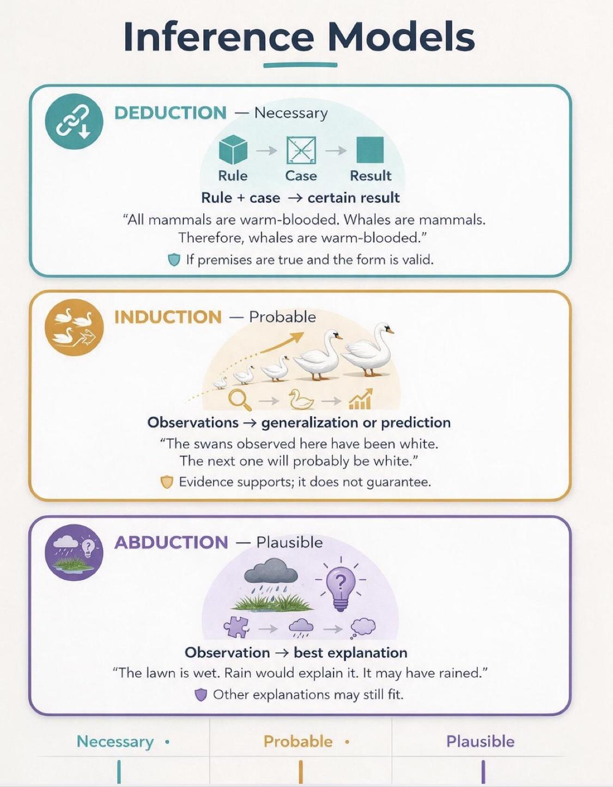

# Observation, inference, and historical reconstruction

An observation records something about the world. An inference connects observations to an explanation. A historical reconstruction proposes a sequence of past events that could account for the present.

Keeping these distinctions visible helps readers ask which part of an argument is measured and which part depends on a model.

The three basic inference models differ in what they can deliver:

## Three tiers, held apart on purpose

**Direct observation.** A measurement, a reading, a recorded feature of the present world. An observation can, in principle, be checked by repeating it or by an independent instrument. It does not, by itself, explain how the observed feature came to be; that step is already an inference.

**Interpretive or theoretical framework.** A structure of assumptions connecting observations into an explanation. A framework can be well-tested within the conditions where it was established and extrapolated well beyond them elsewhere. Extrapolation is not disqualifying on its own, but it should be named rather than absorbed silently into the word "observed."

**Untested or under-tested proposal.** A conjecture that has not yet faced a severe, discriminating test, or that has so far been checked only against the evidence it was built to accommodate. A proposal earns the confidence its actual testing record supports, and no more than that.

A single sentence can slide between these tiers without announcing it, for instance treating a model's output as though it carried the same warrant as the measurement that fed it. This site tries to keep the tiers separated in its own writing and treats a reader catching a place where it fails to do so as a legitimate [objection](objections.md), not a nuisance.

## Presuppositional non-capitulation

BWM does not treat the governing assumptions of a competing worldview as neutral rules of evidence merely because they are embedded in a dominant methodology.

> **Presuppositional Non-Capitulation Principle:** BWM will not grant a competing worldview's metaphysical or methodological exclusions as worldview-neutral premises. Competing models should be compared with their governing assumptions exposed, their interpretations distinguished from observations, and their respective explanatory burdens made visible.

This principle addresses a recurring dialectical structure without imputing motives to individual critics. A methodology can first restrict admissible explanation to natural causes, material utility, or mechanistic categories and then evaluate a biblical model as though those restrictions were neutral features of the evidence itself. If BWM accepts that framing before comparison begins, it has already conceded part of the question under dispute.

Non-capitulation does not exempt BWM from criticism or permit it to invoke revelation as an all-purpose answer. The requirement is symmetrical. BWM must identify its own governing commitments, distinguish them from direct observations, expose auxiliary hypotheses to severe tests, retain genuine anomalies, and state what would count against a proposed explanation. Competing models should be asked to do the same.

The comparison is therefore not between an allegedly presuppositionless reading of nature and a presuppositional biblical reading. It is between explanatory frameworks whose observations, assumptions, boundary conditions, inferential rules, and metaphysical commitments should be made as explicit as practicable.

## Experiential evidence and worldview fit

Not all evidence relevant to worldview comparison is instrument-mediated. Human experience can itself supply data, provided the experience is distinguished from the interpretation placed upon it.

BWM therefore treats recurring experiences of beauty, awe, wonder, sublimity, and apparent transcendence as phenomena to be explained rather than as self-interpreting proofs. A naturalistic account may appeal to evolved cognition, affective systems, pattern recognition, cultural formation, or other mechanisms. A biblical account may expect such responses from a creation intended to evoke contemplation and disclose divine glory. The appropriate question is comparative expectedness and explanatory scope, not whether one side may define the phenomenon out of the evidential set.

In Bayesian terms, the relevant comparison is qualitative unless defensible likelihoods can be supplied: how expected is the observed pattern of human response under each worldview, and what auxiliary assumptions are required to account for it? BWM should not assign numerical likelihoods merely to give the comparison a veneer of precision.

### Quantification without reduction

The use of equations does not imply that every evidential domain is reducible to an equation. Quantitative models are representations of selected variables and relations. Their explanatory reach depends on what has been represented and on the warrant for identifying those variables with the phenomenon of interest.

BWM therefore distinguishes **measurement**, **correlation**, **prediction**, and **ontological identity**. Evidence that a measurable state correlates with or predicts a reported experience can be strong empirical evidence without establishing that the measurable state and the experience are ontologically identical. Moving from correlation or predictive success to reduction is a philosophical step and should be argued as such.

This is the methodological expression of the [Experiential Irreducibility Principle](creation.md#experiential-irreducibility-principle). It permits rigorous quantitative investigation while resisting the inference that whatever a model does not encode is therefore unreal or explanatorily irrelevant.

The same discipline applies to the [Rational-Relational Vocation Principle](creation.md#rational-relational-vocation-principle). Reasoning can be formally represented and relationships can be empirically studied, but neither formal representation nor behavioral measurement should be assumed to exhaust the person who reasons or the relationship in which persons participate.

## Programme structure

Several of the research programmes referenced from this site (see [research programmes](research-programmes.md)) organize their own claims in explicitly Lakatosian terms: a **hard core** of central commitments, a **protective belt** of auxiliary hypotheses that can be revised without abandoning the core, and **severe tests** meant to discriminate between competing accounts rather than merely illustrate a preferred one. These terms are defined individually in the [glossary](sources.md).

Naming a claim's tier, and its place within that structure, is a discipline this site tries to apply consistently. It is not a guarantee that any particular claim survives the discipline; that judgment belongs to the evidence and to the programme's own review record, not to the label.

## Updating an explanation

Bayes' theorem expresses how evidence updates a probability:

$$
P(H \mid E) = \frac{P(E \mid H)P(H)}{P(E)}
$$

Here, $H$ is a hypothesis and $E$ is evidence. The equation alone does not supply the priors, likelihoods, or warrant for a particular historical model. Those require explicit argument and evidence, stated openly enough that a reader can contest them. A prior chosen to secure a preferred conclusion, or a likelihood computed only under a favored hypothesis, does not survive contact with this equation; it merely wears its notation.

## What would change our assessment?

Look for discriminating predictions, severe tests, alternative explanations, and [open problems](open-problems.md). A public summary should preserve the confidence and limitations of its [source programme](research-programmes.md), including the parts that count against it.
