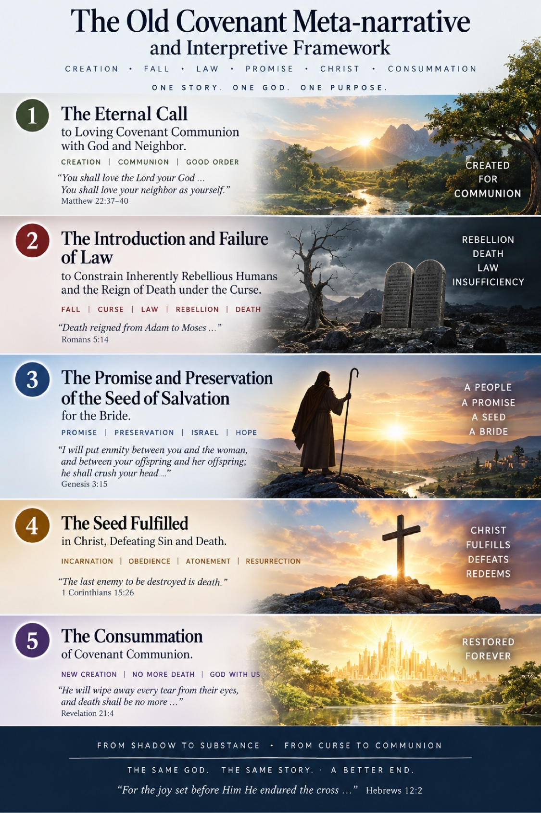

# Beyond the Shadow

## Ordered Love, Creaturely Autonomy, and the Redemptive Meta-Narrative of the Old Testament

**James D. Longmire**  
ORCID: 0009-0009-1383-7698  
Correspondence: jdlongmire@outlook.com

## The Old Covenant Meta-narrative and Interpretive Framework

**The eternal call to loving covenant communion with God and neighbor.**

**The introduction and failure of law to constrain inherently rebellious humans and the reign of death under the Curse.**

**The promise and preservation of the Seed of Salvation for the Bride.**

These three movements provide the direct framing for the argument that follows. The paper develops their internal logic by distinguishing primordial divine law from its later Mosaic codification, natural and properly ordered self-love from autonomous self-reference, and the righteous function of law from its inability to regenerate the fallen heart. In that fuller account, the "introduction" of law in the second movement refers to its progressive formal articulation and covenantal codification within fallen human history, since divine command itself is already present in Eden.

## Abstract

Old Testament ethical challenges are often isolated from the canonical story that gives them their theological function. This paper develops an interpretive rubric grounded in ordered covenant love. Humanity is created for communion with God and neighbor under divine authority. Natural creaturely self-love is good within that communion and is presupposed rather than commanded. Creaturely autonomy disorders love by making the self the governing reference point of good. Rebellion brings the Curse and death. Divine law is present before the Fall and is later expanded and covenantally codified for fallen humanity. Law can reveal, order, restrain, condemn, and teach, but external law cannot regenerate an autonomous heart. The Old Testament therefore moves through communion, rebellion, Curse, law, judgment and accommodation, promise and preservation, toward the promised Seed, the redeemed Bride, and restored communion. This rubric clarifies national judgment, slavery and servitude, and related challenges while leaving every individual passage accountable to its own exegesis.

## 1. Canonical trajectory

The Old Testament does not begin at Sinai. It begins with creation. Before Israel, Mosaic civil legislation, slavery, warfare, and national judgment stands a created order in which humanity receives being, vocation, relationship, moral boundaries, and delegated authority from God (Gen. 1:26-28; 2:15-17).

The governing sequence is:

**Ordered covenant communion -> creaturely autonomy -> rebellion -> Curse and death -> external law confronting fallen humanity -> judgment, restraint, and accommodation -> promise and preservation -> the Seed -> regeneration and the Bride -> consummated covenant communion.**

Difficult Old Testament texts occur inside this history. They should be classified within it before conclusions are drawn about their moral function.

## 2. External law and ordered love

Divine law does not originate at Sinai. Adam receives explicit external command before the Fall (Gen. 2:16-17). Sinai is an expanded covenantal codification of divine law to a people already living under the Curse. The decisive change is therefore the human subject standing under law, not the goodness of law itself.

Jesus identifies love of God and love of neighbor as the commands upon which the Law and Prophets depend (Matt. 22:37-40; Deut. 6:5; Lev. 19:18). The formulation contains an anthropological asymmetry. God-love is commanded. Neighbor-love is commanded. Self-love is presupposed: the neighbor is to be loved "as yourself." Paul similarly assumes ordinary nourishment and care of one's own flesh (Eph. 5:28-29).

### Principle of Ordered Love

**Human beings naturally possess creaturely self-love and therefore require no command to seek their own good. Within proper covenant communion, natural self-love is ordered under love for God and expressed toward the neighbor. Creaturely autonomy disorders this relation by making the self the governing reference point of good. Divine law commands love toward God and neighbor and establishes the boundaries within which natural self-love remains properly ordered.**

Self-love itself is therefore not the Fall. The disorder arises when the creature claims authority to make the self the ultimate moral reference.

## 3. Autonomy, Curse, and the limits of external law

Genesis 3 presents the temptation to be "like God, knowing good and evil" (Gen. 3:5). Humanity receives God's judgment concerning good and evil and asserts an alternative authority. The causal structure is:

**Creaturely autonomy -> self as governing reference -> disordered love -> transgression -> broken communion -> Curse and death.**

The consequences immediately move in both directions of commanded love. Adam and Eve hide from God (Gen. 3:8). Adam turns accusation toward the woman and indirectly toward God (Gen. 3:12). Cain kills Abel (Gen. 4:8). Rebellion against God and destruction of neighbor belong to the same disorder.

The Curse precedes the Mosaic covenant. Paul emphasizes that death "reigned from Adam to Moses" (Rom. 5:14) precisely to establish that death already held humanity under its dominion before the Mosaic Law was given. The giving of the Law therefore neither originates death nor creates the fallen condition it confronts. Death's reign begins with Adamic rebellion and continues through the Mosaic administration until its decisive defeat in the death and resurrection of Christ, while biological death remains the last enemy awaiting final abolition at the consummation (Rom. 5:12-21; 1 Cor. 15:20-26, 54-57; Rev. 20:14; 21:4). Paul can therefore affirm that the law is holy, righteous, and good while describing sin as exploiting the commandment (Rom. 7:7-13).

The redemptive chronology is consequently: **Adam: death begins to reign -> Moses: Law enters an already death-ruled world -> Christ: death is decisively defeated -> consummation: death is finally abolished.**

External law can reveal righteousness, identify transgression, restrain conduct, order covenant society, establish judicial boundaries, and teach typologically. It cannot regenerate the autonomous heart. Fallen humanity's problem is deeper than ignorance of the good. It resists receiving the good from God as authoritative.

## 4. The Decalogue as an ordering of love

The Decalogue objectively orders love. Its first commands govern humanity's relation to God. Idolatry, false worship, misuse of God's name, and rejection of divine authority are vertical expressions of autonomous self-reference.

The neighbor-directed commands restrain the horizontal consequences. Murder sacrifices the neighbor's life. Adultery violates the neighbor's covenantal union. Theft appropriates the neighbor's goods. False witness sacrifices the neighbor's good to another purpose. Covetousness exposes the inward desire beneath such appropriation.

The law therefore constrains what autonomous self-love may do in relation to God and neighbor. This gives theological coherence to Christ's summary of the Law and Prophets.

## 5. Interpretive taxonomy

Difficult texts should first be classified. **Creation ordinance** concerns relationships and purposes belonging to God's good created order. **Moral command** articulates obligations grounded in God's righteous order, centrally expressed through love of God and neighbor. **Fallen-world accommodation and regulation** governs social realities already present within fallen civilization; regulation does not logically entail that the regulated institution is a creation ordinance or eternal moral ideal. **Judicial action** addresses rebellion and its destructive consequences. **Ceremonial and typological law** teaches through sacrifice, priesthood, purity, sacred space, and related anticipatory patterns. **Redemptive preservation** concerns God's historical preservation of the promise and covenant line through which the Seed comes.

These categories may overlap, but they cannot be collapsed into one another.

## 6. National judgment

Canaanite judgment must be read in its stated judicial context. Genesis 15:16 delays possession of the land because the iniquity of the Amorites is "not yet complete." The delay establishes patience and a moral threshold within the narrative. Deuteronomy 9:4-5 denies Israelite righteousness as the ground of possession and identifies the wickedness of the nations as part of the rationale.

The category is judicial rather than racial. Israel later receives severe judgment, invasion, destruction, and exile for covenant rebellion. Election grants no moral immunity.

Ordered love also prevents love from being reduced to permissiveness. Autonomous self-love can become socially predatory. Violence, exploitation, murder, sexual abuse, oppression, and idolatrous social orders injure neighbors. A God who commands neighbor-love is not thereby prohibited from judging entrenched neighbor-destroying evil.

Redemptive preservation belongs to the wider narrative because Israel's survival serves the covenantal trajectory toward the promised Seed. This claim must remain proportional to the texts. Scripture does not warrant treating every act of national judgment exclusively as a biological necessity for preserving the Messianic line.

The rubric therefore resolves the categorical objection that divine love and national judgment are inherently contradictory. It does not automatically settle every conquest passage. Scope, target, rhetoric, historical setting, and stated judicial rationale still require passage-specific exegesis.

## 7. Slavery and servitude

Human dominion over other human beings is absent from the creation commission of Genesis 1-2. Humanity receives dominion over the nonhuman creation. Human coercion and exploitative hierarchy belong to the post-Fall social world.

Mosaic regulations concerning servitude must therefore be classified before they are treated as statements of the creational ideal. Ancient Israel contained legally distinguishable forms of servitude, including debt service and service involving foreigners. Those distinctions must not be flattened.

The governing principle is:

**Divine regulation of a fallen social institution does not by itself constitute divine identification of that institution with the created moral ideal.**

Jesus supplies a canonical precedent for this reasoning in his treatment of divorce. Moses permitted a practice because of hardness of heart, while Jesus appealed beyond the Mosaic accommodation to creation: "from the beginning it was not so" (Matt. 19:3-9). This does not prove that every Mosaic regulation is an accommodation of the same kind. It demonstrates that regulation within fallen conditions and the creational telos are distinguishable biblical categories.

The Exodus makes liberation from oppressive bondage part of Israel's defining memory. Hebrew debt-service receives release provisions and commands of generosity (Deut. 15:12-18). Man-stealing is a capital offense (Exod. 21:16). First Timothy 1:10 later condemns `andrapodistai`, commonly rendered enslavers, slave traders, or kidnappers, with lexical nuance requiring care.

These canonical controls prevent the inference that Mosaic regulation of servitude makes human commodification the eternal moral ideal. They also prevent the opposite simplification in which every ancient form of service is treated as identical to modern race-based chattel slavery. Each law requires its own lexical, legal, historical, and covenantal analysis.

Within the ordered-love rubric, exploitative slavery is intelligible as autonomous self-love consuming the neighbor for the self's perceived benefit. Regulation can restrain fallen conditions. Regeneration addresses the deeper disorder.

## 8. Promise, Seed, and Bride

The Fall is accompanied by promise. Genesis 3:15 introduces conflict between the serpent and the woman and between their offspring, with eventual victory over the serpent. The promise then survives repeated human failure. Noah survives judgment. Abraham is called. Isaac carries the covenant line. Jacob receives the promise. Judah is distinguished. David receives covenant promise. A remnant survives apostasy and exile.

The Old Testament therefore narrates the preservation of God's redemptive promise through the very rebellion that demonstrates humanity's inability to restore itself. The controlling question increasingly becomes: **Where is the promised Seed, and how will God preserve His promise despite human rebellion?**

The framework reaches its center in Christ. Paul identifies Christ as the promised Abrahamic Seed (Gal. 3:16). Christ bears the Curse (Gal. 3:13), fulfills the Law (Matt. 5:17), obeys where Adam and Israel fail, and gives Himself for His Bride (Eph. 5:25-27). His self-giving displays perfectly ordered love: obedience to the Father expressed in sacrificial good toward His people.

## 9. New Covenant and consummation

The solution is not the disappearance of divine law. Jeremiah promises that God will put His law within His people and write it on their hearts (Jer. 31:31-34). Ezekiel promises a new heart, a new spirit, and God's Spirit causing His people to walk in His statutes (Ezek. 36:25-27).

The solution corresponds to the problem. External command can expose and restrain rebellion. It cannot regenerate the rebel. The New Covenant addresses the heart from which disordered love proceeds. The Spirit progressively restores creaturely willing toward God and neighbor.

Revelation 21-22 completes the trajectory with God dwelling with His people, death abolished, the Curse removed, and the tree of life accessible. The biblical movement is therefore:

**Communion -> autonomy -> rebellion -> Curse -> law and restraint -> judgment and accommodation -> promise -> preservation -> Seed -> redemption -> regeneration -> Bride -> consummated communion.**

## 10. Method and limits

The rubric can be applied through eight questions: What creational good supplies the normative horizon? What effects of Fall and Curse are already present? Which interpretive category governs the passage? What does the immediate text actually command, permit, prohibit, judge, or symbolize? How does the wider canon constrain the reading? What redemptive function is explicitly or reasonably indicated? How does the New Covenant retain, transform, fulfill, internalize, or terminate the relevant covenantal form? What does consummation reveal about the enduring moral telos?

The framework remains corrigible. The accommodation category cannot be invoked merely because a modern reader dislikes a command. National judgment must be interpreted from the judicial logic actually stated or canonically warranted. Servitude requires lexical and institutional distinctions. Redemptive preservation cannot be used to invent motives absent from the text. Most importantly, the metanarrative cannot substitute for grammatical and historical exegesis. Scripture interprets Scripture, but a framework becomes illegitimate if it is used to silence contrary textual evidence.

## Conclusion

The Old Testament's difficult texts belong to a coherent redemptive history. Humanity is created for loving covenant communion under divine authority. Natural creaturely self-love is good within that communion and requires no separate command. Love of God and neighbor are commanded because autonomy can turn natural self-concern into the governing reference point of good.

The Fall disorders love. The Curse and death follow. Divine law, already present before the Fall, is progressively articulated and covenantally codified in a world of fallen creatures. It reveals the good, restrains evil, orders covenant life, exposes transgression, and teaches redemptively. It cannot regenerate the heart.

Judgment addresses mature rebellion and its destruction of covenantal and neighborly order. Accommodation regulates fallen social realities without necessarily identifying them as creation ideals. Ceremonial structures teach through shadow. Redemptive preservation carries the promise forward. The Seed comes in Christ, bears the Curse, fulfills the Law, gives Himself for the Bride, and secures the Spirit who writes God's law upon the heart.

The canonical story therefore moves from ordered love, through autonomous rebellion and the long shadow of death, to the restoration of covenant communion in Christ. The difficult texts belong inside that story. Their interpretation must begin there and then return to the text itself for judgment.

## Primary scriptural loci

Genesis 1:26-28; 2:15-17; 3:5-15; 4:8; 15:16. Exodus 20-21. Leviticus 19:18. Deuteronomy 6:5; 9:4-5; 15:12-18. Jeremiah 31:31-34. Ezekiel 36:25-27. Matthew 5:17; 19:3-9; 22:37-40. Romans 5:12-21; 7:7-13. 1 Corinthians 15:20-26, 54-57. Galatians 3:13, 16. Ephesians 5:25-29. 1 Timothy 1:10. Revelation 20:14; 21-22.

Human-Curated, AI-Enabled (HCAE)
